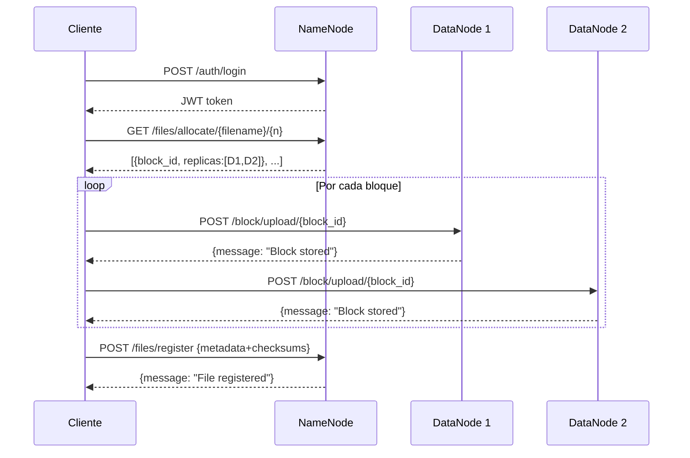

# 📋 Gestión de Tareas — FinalDFS

> Este documento evidencia el uso de una herramienta de gestión de tareas tal como lo exige el enunciado del proyecto (penalidad del 30% ante su ausencia).

---

## Herramienta utilizada: GitHub Projects

**Tablero:** [FinalDFS — Sprint Board](https://github.com/users/JoseVelez/projects/1)
*(Actualizar con el enlace real del tablero una vez creado)*

---

## Estructura del tablero

| Columna | Descripción |
|---------|-------------|
| **Backlog** | Tareas identificadas, aún no iniciadas |
| **En progreso** | Tarea actualmente en desarrollo |
| **En revisión** | Completada, pendiente de validación |
| **Hecho** | Verificada y cerrada |

---

## Sprint 1 — Implementación base ✅

| ID | Tarea | Responsable | Estado |
|----|-------|-------------|--------|
| T-01 | NameNode: endpoints allocate, register, get | Jose_Velezg | ✅ Hecho |
| T-02 | DataNode: upload y get de bloques | JuanVal0308 | ✅ Hecho |
| T-03 | Cliente: script de subida `put` | JuanVal0308 | ✅ Hecho |
| T-04 | Cliente: script de descarga `get` | JuanVal0308 | ✅ Hecho |
| T-05 | Autenticación JWT + bcrypt | Jose_Velezg | ✅ Hecho |
| T-06 | Conexión MongoDB Atlas | Jose_Velezg | ✅ Hecho |
| T-07 | Dockerizar todos los servicios | Jose_Velezg | ✅ Hecho |
| T-08 | Desplegar en AWS EC2 | Ambos | ✅ Hecho |
| T-09 | README.md inicial | Jose_Velezg | ✅ Hecho |

---

## Sprint 2 — Mejoras y completitud ✅

| ID | Tarea | Responsable | Estado |
|----|-------|-------------|--------|
| T-10 | Corregir rutas Docker (`nodo de datos` → `datanode`) | Jose_Velezg | ✅ Hecho |
| T-11 | Aplicar JWT a todos los endpoints de archivos | Jose_Velezg | ✅ Hecho |
| T-12 | CLI: `ls` | Jose_Velezg | ✅ Hecho |
| T-13 | CLI: `rm` | Jose_Velezg | ✅ Hecho |
| T-14 | CLI: `mkdir` / `rmdir` | Jose_Velezg | ✅ Hecho |
| T-15 | CLI unificada con argparse (`dfs_cli.py`) | Jose_Velezg | ✅ Hecho |
| T-16 | Tamaño de bloque configurable (`DFS_BLOCK_SIZE`, default 64 MB) | Jose_Velezg | ✅ Hecho |
| T-17 | Checksum SHA-256 por bloque | Jose_Velezg | ✅ Hecho |
| T-18 | Logs estructurados en NameNode y DataNode | Jose_Velezg | ✅ Hecho |
| T-19 | IPs hardcodeadas → variables de entorno (`PUBLIC_IP`) | Jose_Velezg | ✅ Hecho |

---

## Sprint 3 — Tolerancia a fallos · Integrante 3

> **Responsable:** *(reemplazar con nombre/usuario GitHub)*
> **Criterios impactados:** Comunicación entre nodos (15%) + Demostración distribuida (15%)
> **Rama sugerida:** `feature/heartbeat-replication`

| ID | Tarea | Archivos a modificar | Estado |
|----|-------|----------------------|--------|
| T-20 | Agregar colección `datanodes` en MongoDB y modelo `DataNodeStatus` | `namenode/app/database.py`, nuevo `namenode/app/models.py` | 📋 Backlog |
| T-21 | Endpoint `POST /datanodes/register` en el NameNode | `namenode/app/main.py` | 📋 Backlog |
| T-22 | Endpoint `POST /datanodes/heartbeat` en el NameNode | `namenode/app/main.py` | 📋 Backlog |
| T-23 | Hilo de heartbeat en el DataNode (cada 30 s, al arrancar) | `datanode/app/main.py` | 📋 Backlog |
| T-24 | Job de monitoreo en el NameNode: marcar como `dead` nodos sin heartbeat en >90 s | `namenode/app/main.py` | 📋 Backlog |
| T-25 | Re-replicación activa: al detectar nodo `dead`, identificar bloques huérfanos, descargarlos de la réplica viva y subirlos a otro nodo sano | `namenode/app/main.py` | 📋 Backlog |
| T-26 | Endpoint `GET /datanodes` para ver estado de todos los nodos | `namenode/app/main.py` | 📋 Backlog |
| T-27 | Prueba manual: bajar un DataNode con `docker stop datanode2` y verificar que el sistema re-replica y sigue operativo | — | 📋 Backlog |

### Guía técnica para el Integrante 3

**T-20 — Modelo en MongoDB:**
```python
# namenode/app/database.py — agregar:
datanodes_collection = db["datanodes"]
```

**T-21/T-22 — Endpoints de registro y heartbeat:**
```python
# namenode/app/main.py
from datetime import datetime, timezone

@app.post("/datanodes/register", tags=["DataNodes"])
def register_datanode(node_id: str, url: str):
    datanodes_collection.update_one(
        {"node_id": node_id},
        {"$set": {"url": url, "last_seen": datetime.now(timezone.utc), "status": "alive"}},
        upsert=True
    )
    return {"message": f"DataNode {node_id} registered"}

@app.post("/datanodes/heartbeat", tags=["DataNodes"])
def heartbeat(node_id: str):
    datanodes_collection.update_one(
        {"node_id": node_id},
        {"$set": {"last_seen": datetime.now(timezone.utc), "status": "alive"}}
    )
    return {"status": "ok"}
```

**T-23 — Hilo de heartbeat en el DataNode:**
```python
# datanode/app/main.py — agregar al inicio del módulo
import threading, time, requests as req

def _heartbeat_loop():
    while True:
        try:
            req.post(f"{NAMENODE_URL}/datanodes/heartbeat",
                     params={"node_id": NODE_ID}, timeout=5)
        except Exception:
            pass
        time.sleep(30)

@app.on_event("startup")
def start_heartbeat():
    req.post(f"{NAMENODE_URL}/datanodes/register",
             params={"node_id": NODE_ID, "url": f"http://{NODE_ID}:8001"}, timeout=5)
    threading.Thread(target=_heartbeat_loop, daemon=True).start()
    logger.info(f"Heartbeat iniciado para {NODE_ID}")
```

**T-24/T-25 — Monitoreo y re-replicación:**
```python
# Agregar a namenode/app/main.py — se ejecuta en background al iniciar
import asyncio
from datetime import datetime, timezone, timedelta

async def _monitor_datanodes():
    while True:
        await asyncio.sleep(60)
        threshold = datetime.now(timezone.utc) - timedelta(seconds=90)
        dead = datanodes_collection.find(
            {"last_seen": {"$lt": threshold}, "status": "alive"}
        )
        for node in dead:
            datanodes_collection.update_one(
                {"node_id": node["node_id"]},
                {"$set": {"status": "dead"}}
            )
            logger.warning(f"DataNode caido: {node['node_id']}")
            _rereplicate(node["url"])   # ver lógica abajo

def _rereplicate(dead_url: str):
    """Para cada bloque que tenia replica en dead_url, subir una copia a otro nodo vivo."""
    alive = [n["url"] for n in datanodes_collection.find({"status": "alive"})]
    if not alive:
        return
    affected = files_collection.find(
        {"blocks.replicas": dead_url}
    )
    for file in affected:
        for block in file["blocks"]:
            if dead_url not in block["replicas"]:
                continue
            # Obtener bloque de la réplica viva
            for r in block["replicas"]:
                if r == dead_url:
                    continue
                internal_r = internal_url(r)
                try:
                    data = requests.get(
                        f"{internal_r}/block/{block['block_id']}", timeout=10
                    ).content
                    # Subir a un nodo vivo que no tenga ya el bloque
                    target = next((u for u in alive
                                   if u not in block["replicas"]), None)
                    if target:
                        requests.post(
                            f"{target}/block/upload/{block['block_id']}",
                            files={"file": data}, timeout=30
                        )
                        # Actualizar metadata
                        files_collection.update_one(
                            {"_id": file["_id"],
                             "blocks.block_id": block["block_id"]},
                            {"$push": {"blocks.$.replicas": target},
                             "$pull": {"blocks.$.replicas": dead_url}}
                        )
                        logger.info(f"Re-replicado {block['block_id']} → {target}")
                    break
                except Exception as e:
                    logger.error(f"Error re-replicando {block['block_id']}: {e}")

@app.on_event("startup")
async def start_monitor():
    asyncio.create_task(_monitor_datanodes())
```

---

## Sprint 3 — Documentación e Informe · Integrante 4

> **Responsable:** *(reemplazar con nombre/usuario GitHub)*
> **Criterios impactados:** Diseño y documentación (20%) + Video e informe (10%)
> **Rama sugerida:** `feature/docs-informe`

| ID | Tarea | Entregable | Estado |
|----|-------|------------|--------|
| T-28 | Diagrama de secuencia: flujo PUT completo (cliente→NameNode→DataNodes) | `docs/diagrams/seq_put.png` | 📋 Backlog |
| T-29 | Diagrama de secuencia: flujo GET con failover de réplicas | `docs/diagrams/seq_get.png` | 📋 Backlog |
| T-30 | Diagrama de secuencia: heartbeat y re-replicación (coordinar con Integrante 3) | `docs/diagrams/seq_heartbeat.png` | 📋 Backlog |
| T-31 | Diagrama de despliegue AWS: instancia EC2, contenedores, puertos expuestos | `docs/diagrams/deploy_aws.png` | 📋 Backlog |
| T-32 | Sección de pruebas en el informe: capturas de `ls`, `put`, `get`, `rm` funcionando | `docs/INFORME.md` | 📋 Backlog |
| T-33 | Sección de pruebas: evidencia de distribución de bloques en los 3 DataNodes (`GET /blocks`) | `docs/INFORME.md` | 📋 Backlog |
| T-34 | Sección de pruebas: simulación de caída de DataNode y continuidad del servicio | `docs/INFORME.md` | 📋 Backlog |
| T-35 | Informe técnico completo (objetivo, marco teórico, arquitectura, implementación, pruebas) | `docs/INFORME.md` | 📋 Backlog |
| T-36 | Plantilla de autoevaluación completada y entregada al docente | Archivo PDF/Word | 📋 Backlog |
| T-37 | Video de demostración ≤30 min con todos los integrantes | Subir a Drive/YouTube | 📋 Backlog |

### Guía técnica para el Integrante 4

**T-28 a T-31 — Diagramas (usar draw.io, Mermaid o Lucidchart):**

Diagrama de secuencia PUT en Mermaid (agregar en `docs/diagrams/seq_put.md`):


**T-32 a T-34 — Capturas para el informe:**

Comandos exactos a ejecutar y capturar:
```bash
# 1. Distribución de bloques en los 3 DataNodes
curl http://localhost:8001/blocks
curl http://localhost:8002/blocks
curl http://localhost:8003/blocks

# 2. Subir un archivo grande (>64 MB) para ver múltiples bloques
python dfs_cli.py put archivo_grande.bin

# 3. Simular caída de DataNode y verificar continuidad
docker stop datanode2
python dfs_cli.py get archivo_grande.bin   # debe funcionar con réplicas
docker start datanode2
```

**T-35 — Estructura del `docs/INFORME.md`:**
```
1. Objetivo
2. Marco Teórico (GFS, HDFS, DFS por bloques vs objetos)
3. Descripción del servicio
4. Arquitectura del sistema (incluir diagramas T-28 a T-31)
5. Especificación de protocolos y APIs
6. Algoritmos (particionamiento Round-Robin, replicación, re-replicación)
7. Entorno de ejecución (Docker + AWS EC2)
8. Pruebas y análisis de resultados (capturas T-32 a T-34)
9. Conclusiones
```

**T-36 — Plantilla de autoevaluación:**
Solicitar al docente el formato exacto. Evaluar cada criterio del enunciado honestamente con base en lo implementado.

**T-37 — Video (≤30 min, todos los integrantes visibles):**
```
Estructura sugerida:
  0:00 - 3:00  Presentación del equipo y objetivo del sistema
  3:00 - 8:00  Explicación de la arquitectura (mostrar diagramas)
  8:00 - 18:00 Demo en vivo:
                 · docker-compose up
                 · register + login
                 · put de archivo grande (mostrar bloques en cada DN)
                 · ls, get, rm
                 · docker stop datanode2 → get sigue funcionando
  18:00 - 25:00 Explicación del código (heartbeat, re-replicación)
  25:00 - 30:00 Conclusiones y aprendizajes
```

---

## Resumen de asignación final

| Integrante | Sprint | Tareas | Criterios impactados |
|------------|--------|--------|----------------------|
| Jose_Velezg | 1 + 2 | T-01 a T-19 | Todos | ✅ |
| JuanVal0308 | 1 | T-02, T-03, T-04 | CLI, DataNode | ✅ |
| **Integrante 3** | **3** | **T-20 a T-27** | **Comunicación (15%) + Demo (15%)** | 📋 |
| **Integrante 4** | **3** | **T-28 a T-37** | **Documentación (20%) + Video (10%)** | 📋 |

---

## Convenciones de commits

```
<tipo>(<alcance>): <descripción breve>

feat(namenode): agregar endpoint POST /datanodes/heartbeat
fix(datanode): corregir hilo de heartbeat al arrancar
docs(informe): agregar sección de pruebas y resultados
```

---

## Evidencia de participación

| Integrante | Responsabilidad principal |
|------------|--------------------------|
| Jose_Velezg | NameNode, Auth, Docker, CLI completa, variables de entorno |
| JuanVal0308 | DataNode, scripts de cliente put/get |
| Integrante 3 | Heartbeat, detección de fallos, re-replicación activa |
| Integrante 4 | Diagramas formales, informe técnico, video, autoevaluación |
