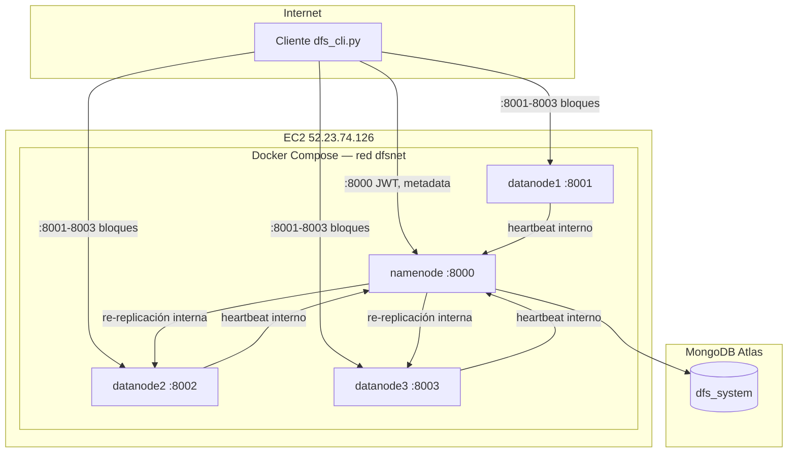

# Diagrama de despliegue — AWS EC2

## Puertos expuestos (Security Group)

| Puerto | Servicio |
|--------|----------|
| 22 | SSH |
| 8000 | NameNode |
| 8001 | DataNode 1 |
| 8002 | DataNode 2 |
| 8003 | DataNode 3 |

## Variables clave

| Archivo | Variable | Valor en producción |
|---------|----------|---------------------|
| `.env` | `PUBLIC_IP` | `52.23.74.126` |
| `namenode/.env` | `MONGO_URI` | MongoDB Atlas |
| `namenode/.env` | `JWT_SECRET` | Clave del servidor |
