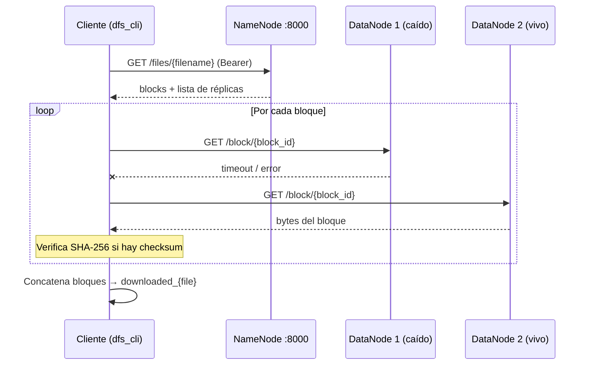

# Diagrama de secuencia — Flujo GET con failover

```mermaid
sequenceDiagram
    participant C as Cliente (dfs_cli)
    participant N as NameNode :8000
    participant D1 as DataNode 1 (caído)
    participant D2 as DataNode 2 (vivo)

    C->>N: GET /files/{filename} (Bearer)
    N-->>C: blocks + lista de réplicas

    loop Por cada bloque
        C->>D1: GET /block/{block_id}
        D1--xC: timeout / error
        C->>D2: GET /block/{block_id}
        D2-->>C: bytes del bloque
        Note over C: Verifica SHA-256 si hay checksum
    end

    C->>C: Concatena bloques → downloaded_{file}
```

## Descripción

Si la primera réplica no responde, el cliente intenta la siguiente automáticamente (tolerancia a fallos en lectura).
