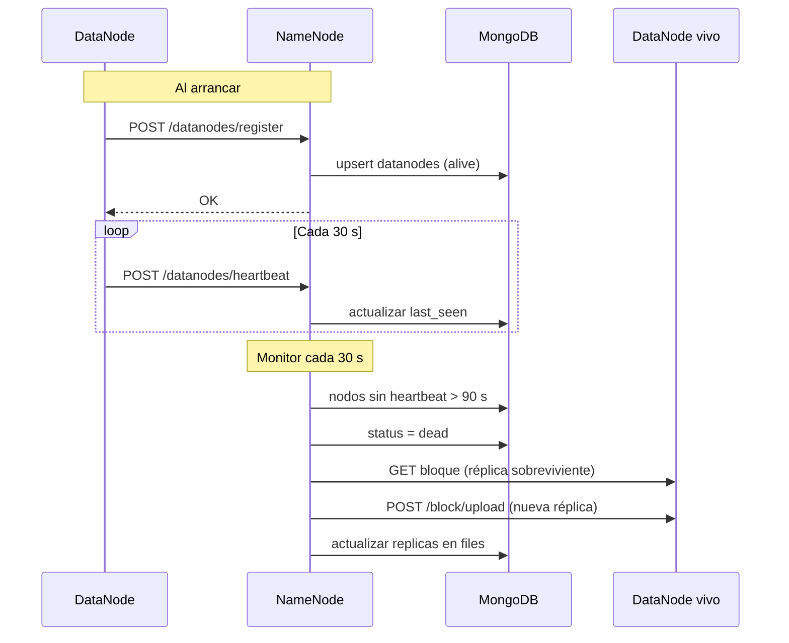

# Diagrama de secuencia — Heartbeat y re-replicación

## Descripción

- Los DataNodes se registran y envían heartbeat periódico.
- El NameNode marca nodos inactivos como `dead`.
- Se re-replican bloques huérfanos hacia nodos vivos.
