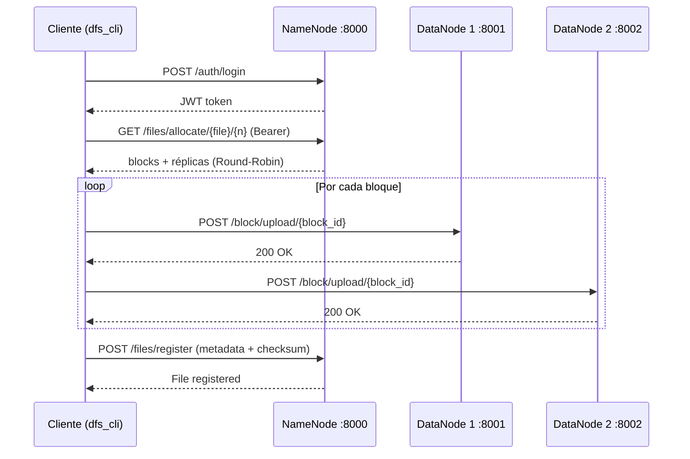

# Diagrama de secuencia — Flujo PUT

## Descripción

1. El cliente autentica y obtiene JWT.
2. El NameNode asigna bloques con factor de replicación 2.
3. El cliente sube cada bloque directamente a las réplicas.
4. Se registra la metadata en MongoDB.
